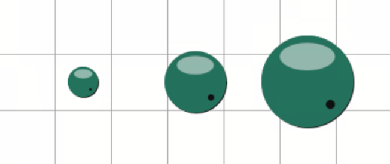

# Open Cross-Stitch File Format (OXS)

OXS is an open file format for cross-stitch patterns that was created by [UrsaSoftware](https://ursasoftware.com).

Since OXS is built on XML, it is simple to examine its structure.
The format is highly extensible, allowing users to add their own attributes and define custom sections and elements.

This document offers a detailed specification of the OXS format, extending the original version.
It adds thorough explanation of each section and element, outlines the usage of each attribute and defines the expected behavior of parsers.
There's also a collection of application-specific items and additional examples.

> You can find a practical OXS parser [here](https://github.com/embroidery-space/embroiderly/blob/main/src-tauri/src/core/parsers/oxs.rs).

## Conventions

The key words "MUST", "MUST NOT", "REQUIRED", "SHALL", "SHALL NOT", "SHOULD", "SHOULD NOT", "RECOMMENDED", "MAY", and "OPTIONAL" in this document are to be interpreted as described in [RFC 2119](https://datatracker.ietf.org/doc/html/rfc2119).

### Specification Conventions

1. All element and property names SHOULD be in [snake case](https://en.wikipedia.org/wiki/Snake_case).

### Common Data Types

- `string` - Represents a sequence of characters encoded in UTF-8.
- `integer` - Represents a whole number without a fractional component in base 10.

  - Currently, only unsigned integers are expected to be used.

- `number` - Represents a numeric value that can be either an integer or a floating-point number.

  - Currently, only unsigned number are expected to be used.

  - Stringified floating-point numbers can contain a decimal separator (period, `.`).
    Only the period (`.`) is allowed as a decimal separator.

  - However, there are some software that use a comma (`,`) as a decimal separator.
    Therefore, it is RECOMMENDED to normalize the string before parsing the value.

  - The exponential notation is not expected to be used, but it should be supported.

- `rgb` - Represents a hexadecimal representation of an [RGB color](https://en.wikipedia.org/wiki/RGB_color_model).

  - The color value is specified as a six-character string (`RRGGBB`) without a leading `#`.
    Each component (`RR`, `GG`, `BB`) is a two-digit hexadecimal number (`00` to `FF`) representing the red, green, and blue color channels, respectively.

  - In addition to specific color values, the special value `nil` is allowed, indicating the absence of a color.

- `cmyk` - Represents a hexadecimal representation of a [CMYK color](https://en.wikipedia.org/wiki/CMYK_color_model).

  - The color value is specified as an eight-character string (`CCMMYYKK`) without a leading `#`.
    Each component (`CC`, `MM`, `YY`, `KK`) is a two-digit hexadecimal number (`00` to `FF`) representing the cyan, magenta, yellow, and key (mostly, black) color channels, respectively.

  - In addition to specific color values, the special value `nil` is allowed, indicating the absence of a color.

- `boolean` - Represents a logical value and can have one of two states: `true` or `false`.

  - Only lowercase state strings are allowed.

  - However, there are some software that use uppercase strings.
    Therefore, it is RECOMMENDED to normalize the string before parsing the value.

## `chart`

The file itself begins with an encompassing element called `chart`.

```xml
<?xml version="1.0" encoding="UTF-8"?>
<chart>
  <!-- content -->
</chart>
```

This is the only element REQUIRED for parsing the pattern.
If the file does not contain the `chart` tag, an error MUST be returned.

It is also RECOMMENDED to check that the file contains a closing `chart` tag.
That is, we expect the parsing of the pattern to be completed at the closing `chart` tag, not at EOF.

Below is a description of typical sections and their elements that are common in patterns.

### `format`

The first section is OPTIONAL and is purely informational - just a brief format description.

```xml
<format
  comments01="Designed to allow interchange of basic pattern data between any cross stitch style software"
  comments02="the 'properties' section establishes size, copyright, authorship and software used"
  comments03="The features of each software package varies, but using XML each can pick out the things it can deal with, while ignoring others"
  comments04="The basic items are :"
  comments05="'palette'..a set of colors used in the design: palettecount excludes cloth color, which is item 0"
  comments06="'fullstitches'.. simple crosses"
  comments07="'backstitches'.. lines/objects with a start and end point"
  comments08="(There is a wide variety of ways of treating part stitches, knots, beads and so on.)"
  comments09="Colors are expressed in hex RGB format."
  comments10="Decimal numbers use US/UK format where '.' is the indicator - eg 0.5 is 'half'"
  comments11="For readability, please use words not enumerations"
  comments12="The properties, fullstitches, and backstitches elements should be considered mandatory, even if empty"
  comments13="element and attribute names are always lowercase"
/>
```

### `properties`

This section is OPTIONAL and defines general pattern properties.
It is RECOMMENDED to keep this section at the top of the file, as it can be used as a reference for parsing the pattern file.

Attributes:

- `oxsversion`: string - The version of the OXS format.
  If not specified, we assume that the latest OXS version is used (currently, `1.0`).
- `software`: string - Specifies the software used to write the pattern file.
  Can be used to indicate app-specific elements and attributes.
- `software_version`: string - Specifies the software version used to write the pattern file.
  Can be used to indicate app/version-specific elements and attributes.
- `chartheight`: integer - Defaults to `100`.
- `chartwidth`: integer - Defaults to `100`.
- `charttitle`: string - Defaults to the name of the file.
- `author`: string.
- `copyright`: string.
- `instructions`: string.
- `stitchesperinch`: number - Specifies the number of stitches per inch of cloth/fabric.
- `stitchesperinch_y`: number - Same as `stitchesperinch`, but for vertical axis.
  Can be used for non-square cloth/fabric.
  If not specified, the value from `stitchesperinch` can be used.
- `palettecount`: integer - The number of palette colors other than cloth/fabric.

All of these attributes are OPTIONAL.
However, it is RECOMMENDED that you specify at least `oxsversion` for consistency, and `chartwidth` and `chartheight` for correct display.

If some of the attributes are not specified but are required by a particular software, they can be replaced by the default value of that software.

```xml
<properties
  oxsversion="1.0"
  software="Ursa Software"
  software_version="2021"
  chartheight="73"
  chartwidth="69"
  charttitle="Piggies"
  author="Unknown"
  copyright="by Ursa Software"
  instructions="Enjoy the embroidery process!"
  stitchesperinch="14"
  stitchesperinch_y="14"
  palettecount="7"
/>
```

### `palette`

Holds `palette_item` elements.

If the `palette` tag is missing or empty, this means that the palette is empty.

During parsing, you can use `properties.palettecount`, if specified, to properly handle the `palette`.
However, the only source of truth about a palette is the `palette` itself.

Note that the size of the palette is not restricted and can contain any number of `palette_item`s.

#### `palette_item`

Defines color information in the palette and can represent a thread, bead, or any other material color.

Attributes:

- `index`: integer.
- `number`: string - Specifies both the color brand and the color number (for example, `DMC 310`).

  In Ursa, they are separated by four spaces.
  In other programs, they can be separated by a single space.

  For some reason, WinStitch adds `[+]` to the end of the `number` if the color is a blend.
  Therefore, it is RECOMMENDED to remove it to correctly parse the color number.

  In a normalized string, the last part of the string splitted by a space is the number (we expect the number to be a solid string), and everything before it is the brand.

- `name`: string.
- `color`: rgb - Defaults to `FFFFFF` (white) for cloth/fabric and `FF00FF` (magenta) for materials.
- `printcolor`: rgb - Specifies the color used for color printing on paper.
- `blendcolor`: rgb - Specifies the color blended with the base color.
- `comments`: string.
- `strands`: integer - The number of thread for stitching.
  If specified, it SHOULD be in the range of 1 to 6.
- `symbol`: integer or string - Specifies the symbol used to graphically represent the color.
  It can be a decimal number representing a UTF-8 [code point](https://developer.mozilla.org/en-US/docs/Glossary/Code_point) or a string representing the actual character.
- `symbol_courier` _by MiniStitch (UrsaSoftware_): string - Specifies the actual symbol character (for example, `A`).
- `symbolcolor` _by XSPro Platinum (DP Software)_: rgb - Specifies the font color of the symbol.
- `bsstrands`: integer - The number of thread for stitching back stitches and other "line" stitches.
  If specified, it SHOULD be in the range of 1 to 6.
- `bscolor`: rgb - Specifies the color of a back stitch.
- `fontname` _by XSPro Platinum (DP Software)_: string - Specifies the font family (for example, `Cross Stitch Pro Platinum`) used to draw symbols of this color.
- `metalic` _by XSPro Platinum (DP Software)_: boolean - Specifies whether the color represents a metalic thread.
- `fluorescent` _by XSPro Platinum (DP Software)_: boolean - Specifies whether the color represents a fluorescent thread.
- `colorcmyk`, `bscolorcmyk`, `printcolorcmyk` _by XSPro Platinum (DP Software)_: cmyk - Specifies the color of the corresponding attribute in the CMYK color model.
  These are important for publishers who will likely print their patterns on paper, so they want to achieve high-quality thread color reproduction.

Additional attributes:

- `kind` _by Embroidery_: string - If the `palette_item` represents a cloth/fabric color, it MAY have a `kind` attribute that specifies the kind of the cloth/fabric.
  The common values are "Aida", "Evenweave", "Linen".

All of these attributes except `color` are OPTIONAL.
If the `color` attribute is missing, empty or `nil`, the application SHOULD replace it with the default color (see notes above) and notify the user about it so that they can fix the issue later.

The `palette_item` element with index `0` (usually, the first one) always defines the cloth/fabric color.
If the `index` attribute is not specified, the first `palette_item` in the palette is assumed to define the cloth/fabric color.

```xml
<palette>
  <!-- The element with index 0 defines the cloth/fabric color. -->
  <palette_item index="0" number="cloth" name="cloth" color="FFFFFF" />

  <!-- Other elements define the material colors. -->
  <palette_item index="1" number="DMC    310" name="Black" color="2C3225" printcolor="000000" strands="2" symbol="100" bsstrands="1" bscolor="2C3225" />
  <palette_item index="2" number="DMC 158 [+]" name="DMC 158 [+] DMC 208" color="303065" blendcolor="824596" printcolor="593A7D" />
</palette>
```

##### `blend`

This is a special element used by Embroiderly to store additional information about blends.

Using the `blendcolor` attribute of the `palette_item` element you can specify only one color which is blended with the main color.
In contrast, using the `blend` element you can specify any number of colors used in a blend.

Attributes:

- `number`: string.
- `name`: string.
- `color`: rgb.
- `strands`: integer.

These attributes are the same as in the `palette_item` element.

```xml
<!-- This color is a blend of four colors. -->
<palette_item index="1" number="Blend 1" name="Crimson Red" color="CB3B41" strands="4">
  <blend number="DMC 326" name="Rose VY DK" color="A9353E" strands="1" />
  <blend number="DMC 309" name="Geranium" color="B74254" strands="1" />
  <blend number="DMC 606" name="Bright Orange-Red" color="E7464B" strands="1" />
  <blend number="DMC 3801" name="Christmas Red LT" color="E02E23" strands="1" />
</palette_item>
```

### General Processing of Stitches

Before we start describing stitch sections, it is worth defining how we handle all stitch objects in general.
The following rules apply to all stitch objects.

In general, all stitch objects have coordinates (`x` and `y`) and an index of the palette item (`palindex`).
Some stitch objects can have multiple instances of these properties (for example, `x1` and `x2` or `palindex1` and `palindex2`).

Also, some stitch objects have an `objecttype` attribute that specifies the type of the stitch object.

In addition, each stitch object MAY have a `marked` attribute that marks the stitch as "marked" or "completed".
This attribute can be used to keep track of the progress of the stitching of a pattern.

The stitch is considered to be "invalid" and MUST NOT be processed, stored or displayed in such cases:

1. If any stitch coordinate is missing or invalid (i.e., it cannot be converted from a string type to a numeric type).

   However, coordinates that are outside the pattern are considered correct.
   For example, if the size of the pattern is not specified in the `properties` section, some stitches may appear outside the pattern.
   We SHOULD process and store such stitches and let the user process them (for example, increase the size of the pattern or remove extra stitches).

2. If the `palindex` attribute is set to `0` (i.e., the stitch refers to a cloth/fabric color).

   Obviously, you SHOULD NOT store such stitches in the pattern file.

3. If the stitch refers to a non-existent palette item.
4. If the stitch is supposed to have an `objecttype` attribute, but it is missing or empty.

### `fullstitches`

Holds `stitch` elements.

If the `fullstitches` tag is missing or empty, this means that the pattern does not contain full stitches.

#### `stitch`

Defines full stitch information.

Attributes:

- `x`: number.
- `y`: number.
- `palindex`: integer.
- `marked`: boolean.

<figure>
  
  <figcaption>
    Full stitches in WinStitch.
  </figcaption>
</figure>

```xml
<fullstitches>
  <!-- This stitch is "empty" because it uses the cloth/fabric color. -->
  <stitch x="1" y="1" palindex="0" />

  <!-- These are normal stitches. -->
  <stitch x="2" y="2" palindex="1" />
  <stitch x="3" y="3" palindex="2" />
  <stitch x="4" y="4" palindex="3" marked="true" />
</fullstitches>
```

### `partstitches`

Holds `partstitch` elements.

#### `partstitch`

Defines part stitch information.

Attributes:

- `x`: number.
- `y`: number.
- `palindex1`: integer.

  For three-quarter stitches, specifies the color on the left.

  For half/gobelin stitches, specifies the color of the entire stitch.

- `palindex2`: integer.

  Only applicable for three-quarter stitches.
  Specifies the color on the right.

- `direction`: integer - Specifies the direction of the part stitch.

  The possible values are:

  - `1` and `2` for three-quarter stitches.
  - `3` and `4` for half/gobelin stitches.

- `marked`: boolean.

<figure>
  
  <figcaption>
    Half/gobeling and three-quarter stitches in WinStitch.
  </figcaption>
</figure>

1. Half/Gobelin stitches:

   - The top one is with `direction=3` (forward).
   - The bottom one is with `direction=4` (backward).

2. Three-quarter stitches:

   - The top-left one is with `direction=2`, `palindex1` set and `palindex2` not set.
   - The top-right one is with `direction=1`, `palindex1` not set and `palindex2` set.
   - The bottom-left one is with `direction=1`, `palindex1` set and `palindex2` not set.
   - The bottom-right one is with `direction=2`, `palindex1` not set and `palindex2` set.

Three-quarter stitches usually represent a single object (and are therefore drawn using a single stitch tool).
However, some applications MAY represent them as a combination of a quarter (1/2 of a half/gobelin stitch) or petit (1/4 of a full stitch) stitch and a half/gobelin stitch.

A single three-quarter stitch can have colors for both sides, so it will fill the entire cell.
Note that there cannot be more than one `partstitch` object in a cell, although this is not a significant problem.

```xml
<partstitches>
  <!-- These are half/gobelin stitches (group 1 in the screenshot above). -->
  <partstitch x="1" y="1" palindex1="1" palindex2="0" direction="3"/>
  <partstitch x="1" y="3" palindex1="1" palindex2="0" direction="4"/>

  <!-- These are three-quarter stitches (group 2 in the screenshot above). -->
  <partstitch x="3" y="1" palindex1="2" palindex2="0" direction="2"/> <!-- top-left -->
  <partstitch x="5" y="1" palindex1="0" palindex2="2" direction="1"/> <!-- top-right -->
  <partstitch x="3" y="3" palindex1="2" palindex2="0" direction="1"/> <!-- bottom-left -->
  <partstitch x="5" y="3" palindex1="0" palindex2="2" direction="2"/> <!-- bottom-right -->
</partstitches>
```

### `backstitches`

Holds `backstitch` elements.

If the `backstitches` tag is missing or empty, this means that the pattern does not contain back stitches.

#### `backstitch`

Defines back stitch information.

Attributes:

- `x1`: number.
- `x2`: number.
- `y1`: number.
- `y2`: number.
- `palindex`: integer.
- `objecttype`: string - Specifies the type of a back stitch.

  The known values are:

  - `backstitch` - A regular back stitch.

    <figure>
      
      <figcaption>
        Back stitches in WinStitch.
      </figcaption>
    </figure>

  - `daisy` _by Ursa Software_ - A simple, single-loop embroidery stitch, usually joined together into a chain.
    Thus, also known as a chain stitch.

    <figure>
      
      <figcaption>
        Daisy stitches in WinStitch.
      </figcaption>
    </figure>

    <figure>
      
      <figcaption>
        Daisy/chain stitches in reality.
      </figcaption>
    </figure>

  - `bugle` _by Ursa Software_ - A stitch with a bugle bead.

    <figure>
      
      <figcaption>
        Bugle beads in WinStitch.
      </figcaption>
    </figure>

    <figure>
      
      <figcaption>
        Bugle beads in reality.
      </figcaption>
    </figure>

  - `straightstitch` _by Embroiderly_ - A long back stitch.

    In Embroiderly, back stitches can be only one cell long.
    Straight stitches, in contrast, can be any length.

  - `curvedstitch` _by Embroiderly_ - A curved stitch.

    In Embroiderly, curved stitches are part of special stitch models.

    Curved stitches have an unspecified number of `x` and `y` coordinates.

  The software that does not actually support `daisy`, `bugle` or `straightstitch` objects MAY process them as `backstitch`.

- `sequence`: integer - Specifies the order in which the elements are rendered.
  In fact, it represents the z-index.
  Objects with a higher value of `sequence` overlap objects with a lower value of `sequence`.

- `marked`: boolean.

```xml
<backstitches>
  <backstitch x1="2" x2="5" y1="2" y2="2.5" palindex="3" objecttype="backstitch" sequence="0"/>
  <backstitch x1="3" x2="4" y1="3" y2="2" palindex="1" objecttype="daisy" sequence="0"/>
  <backstitch x1="6" x2="6" y1="2" y2="5" palindex="1" objecttype="bugle" sequence="0"/>
  <backstitch
    x1="1.00" y1="0.00"
    x2="0.43" y2="0.26"
    x3="0.06" y3="0.66"
    x4="0.06" y4="1.03"
    x5="0.50" y5="1.06"
    x6="0.89" y6="0.66"
    x7="1.10" y7="0.10"
    palindex="1" objecttype="curvedstitch"
  />
</backstitches>
```

### `ornaments_inc_knots_and_beads`

Holds `object` elements.

If the `ornaments_inc_knots_and_beads` tag is missing or empty, this means that the pattern does not contain additional objects.

#### `object`

The `object` element defines anything that can be added by other software.

Attributes:

- `x1`: number.
- `y1`: number.
- `palindex`: integer.
- `objecttype`: string - Specifies the type of an object.

  The known values are:

  - `quarter` - A small (1/4) full stitch.
    It is also known as a petit.

    Additional attributes:

    - `petit` _by XSPro Platinum (DP Software)_: boolean - Specifies whether the stitch is actually a **quarter** stitch (1/2 of a half stitch) or a **petit** stitch (1/4 of a full stitch).

      If `true`, we consider this stitch to be a **petit** stitch.
      Otherwise, we consider this stitch to be a **quarter** stitch.

  - `tent` _by XSPro Platinum (DP Software)_ - A half stitch.
    It MAY represent the type of stitches as the `partstitch` elements with the `direction` set to `3` or `4`.

    Additional attributes:

    - `direction`: integer - Specifies the direction of the part stitch.

      The possible values are:

      - `1` - backward.
      - `2` - forward.

  - `horizontalhalf`, `verticalhalf` _by UrsaSoftware_ - A stitch with half size of a full stitch.

    <figure>
      
      <figcaption>
        Horizontal and vertical half stitches in WinStitch.
      </figcaption>
    </figure>

  - `fullcross` _by UrsaSoftware_ - A normal cross stitch which, unlike a `fullstitch`, can be placed anywhere on the cloth/fabric.

    <figure>
      
      <figcaption>
        Full croses in WinStitch.
      </figcaption>
    </figure>

  - `3x2`, `2x3`, `3x3`, `4x4`, `4x2`, `6x2`, `8x2`, `10x2`, `12x2`, `16x2` _by UrsaSoftware_ - Normal stitches that are slightly larger than usual.

    They are typically used for knitting.

    <figure>
      
      <figcaption>
        Large stitches in WinStitch.
      </figcaption>
    </figure>

  - `topleftlongtriangle` `botrightlongtriangle` `toprightlongtriangle` `botleftlongtriangle` `topleftwidetriangle` `botrightwidetriangle` `botleftwidetriangle` `toprightwidetriangle` _by UrsaSoftware_ - Triangle stitches.

    <figure>
      
      <figcaption>
        Triangle stitches in WinStitch.
      </figcaption>
    </figure>

  - `knot` - A french knot.

    <figure>
      
      <figcaption>
        French knots in WinStitch.
      </figcaption>
    </figure>

  - `bead` - A bead.
    In WinStitch it is 2 mm in size.

    Additional attributes:

    - `length`, `diameter` _by Embroiderly_: number - Bead dimensions.

  - `bead1mm`, `bead2.5mm`, `bead3mm`, `bead5mm`, `bead6mm`, `bead8mm`, `bead12mm` - Beads with the size specified.

    <figure>
      
      <figcaption>
        Beads in WinStitch.
      </figcaption>
    </figure>

  - `specialstitch` _by Embroiderly_ - A special stitch from the XSD pattern.

    Stitch objects of this type have a `modindex` attribute that specifies the index of the special stitch model defined in the `special_stitch_models` section.
    If this attribute is missing or empty, then we consider this special stitch to be invalid.

    Additional attributes:

    - `rotation`: integer - Specifies the angle of rotation of the stitch in degrees.
    - `flip_x`, `flip_y`: boolean - Specifies whether the stitch should be flipped along the corresponding axis.

- `marked`: boolean.

```xml
<ornaments_inc_knots_and_beads>
  <!-- These objects should be rendered as petits. -->
  <object x1="1" y1="4" palindex="1" objecttype="quarter"/>
  <object x1="2" y1="4" palindex="1" objecttype="quarter" petit="true"/>

  <!-- This object should be rendered as a quarter stitch. -->
  <object x1="4" y1="4" palindex="1" objecttype="quarter" petit="false"/>

  <!-- A backward half stitch. -->
  <object x1="5" y1="5" palindex="2" objecttype="tent" direction="1"/>
  <!-- A forward half stitch. -->
  <object x1="5" y1="5" palindex="2" objecttype="tent" direction="2"/>

  <!-- Horizontal and vertical half stitches. -->
  <object x1="2" y1="2" palindex="3" objecttype="horizontalhalf"/>
  <object x1="3" y1="3" palindex="3" objecttype="verticalhalf"/>

  <!-- Full cross. -->
  <object x1="3.5" y1="2.5" palindex="2" objecttype="fullcross" />

  <!-- Large stitches. -->
  <object x1="2" y1="2" palindex="1" objecttype="2x3" />
  <object x1="3.5" y1="2" palindex="1" objecttype="3x2" />
  <object x1="2" y1="4" palindex="2" objecttype="3x3" />
  <object x1="4" y1="3.5" palindex="2" objecttype="4x4" />
  <object x1="2" y1="6" palindex="3" objecttype="4x2" />
  <object x1="5" y1="6" palindex="3" objecttype="6x2" />
  <object x1="2" y1="8" palindex="4" objecttype="10x2" />
  <object x1="2" y1="10" palindex="4" objecttype="12x2" />
  <object x1="2" y1="12" palindex="5" objecttype="14x2" />
  <object x1="2" y1="14" palindex="5" objecttype="16x2" />

  <!-- Triangle stitches. -->
  <object x1="1" y1="1" palindex="1" objecttype="topleftlongtriangle"/>
  <object x1="1" y1="2" palindex="1" objecttype="botrightlongtriangle"/>
  <object x1="3" y1="1" palindex="2" objecttype="toprightlongtriangle"/>
  <object x1="3" y1="2" palindex="2" objecttype="botleftlongtriangle"/>
  <object x1="1" y1="5" palindex="3" objecttype="topleftwidetriangle"/>
  <object x1="2" y1="5" palindex="3" objecttype="botrightwidetriangle"/>
  <object x1="1" y1="7" palindex="5" objecttype="botleftwidetriangle"/>
  <object x1="2" y1="7" palindex="5" objecttype="toprightwidetriangle"/>

  <!-- French knot. -->
  <object x1="1" y1="1" palindex="2" objecttype="knot" />

  <!-- Beads. -->
  <object x1="1.5" y1="1.5" palindex="1" objecttype="bead1mm" />
  <object x1="3.5" y1="1.5" palindex="1" objecttype="bead" />
  <object x1="5.5" y1="1.5" palindex="1" objecttype="bead2.5mm" />

  <!-- A special stitch. -->
  <object x1="10" y1="5.5" palindex="3" modindex="0" rotation="90" flip_x="true" flip_y="false" objecttype="specialstitch"/>
</ornaments_inc_knots_and_beads>
```

### `special_stitch_models` _by Embroiderly_

Holds `model` elements.

If the `special_stitch_models` tag is missing or empty, this means that the pattern does not contain special stitch models.

#### `model`

Defines special stitch model information.

- `unique_name`: string.
- `name`: string.
- `width`: number.
- `height`: number.

The `model` element contains `backstitch` (with object types `backstitch`, `straightstitch`, `curvedstitch`) and `object` elements (with object type `knot`).

The `palindex` attribute is not actually used for special stitch models, but is specified to make their elements valid.

```xml
<special_stitch_models>
  <model unique_name="Rhodes Heart - over 6" name="Rhodes Heart" width="3.0" height="2.5">
    <backstitch x1="1.0" x2="2.0" y1="2.0" y2="0.0" palindex="1" objecttype="straightstitch"/>
    <backstitch x1="0.5" x2="2.5" y1="1.5" y2="0.0" palindex="1" objecttype="straightstitch"/>
    <backstitch x1="0.0" x2="3.0" y1="1.0" y2="0.5" palindex="1" objecttype="straightstitch"/>
    <backstitch x1="0.0" x2="3.0" y1="0.5" y2="1.0" palindex="1" objecttype="straightstitch"/>
    <backstitch x1="0.5" x2="2.5" y1="0.0" y2="1.5" palindex="1" objecttype="straightstitch"/>
    <backstitch x1="1.0" x2="2.0" y1="0.0" y2="2.0" palindex="1" objecttype="straightstitch"/>
    <backstitch x1="1.5" x2="1.5" y1="0.5" y2="2.5" palindex="1" objecttype="straightstitch"/>
  </model>
  <model unique_name="Lazy Daisy" name="Lazy Daisy" width="1.0" height="1.5">
    <backstitch
      x1="1.00" y1="0.00"
      x2="0.43" y2="0.26"
      x3="0.06" y3="0.66"
      x4="0.06" y4="1.03"
      x5="0.50" y5="1.06"
      x6="0.89" y6="0.66"
      x7="1.10" y7="0.10"
      palindex="1" objecttype="curvedstitch"
    />
    <backstitch
      x1="0.03" y1="1.13"
      x2="0.23" y2="0.93"
      palindex="1" objecttype="curvedstitch"
    />
  </model>
</special_stitch_models>
```
